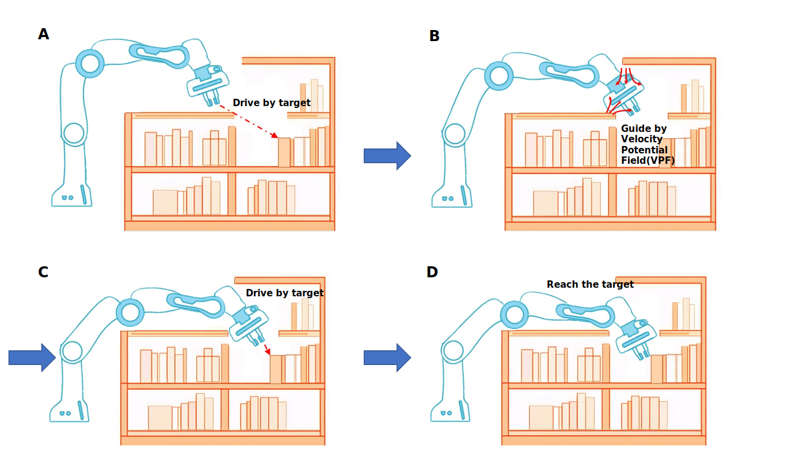
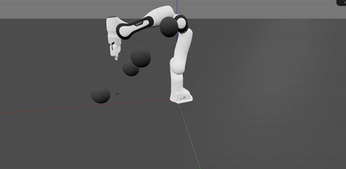

# DMVG: Dynamic Motion Velocity Guidance

DMVG is a novel algorithm designed to enhance obstacle avoidance and motion control for robotic manipulators. By dynamically adjusting the velocity guidance and isolating target-driven and obstacle-avoidance tasks, DMVG achieves superior performance in complex environments compared to traditional methods.



---

## Features
- **Dynamic Guidance**: DMVG uses a dynamically adjustable velocity-guidance potential field to guide robots around obstacles efficiently.
- **Dual-Mode Control**: Combines a target-driven mode with a bypass mode for conflict-free execution.
- **Robust Performance**: Achieves high success rates across varying environments and obstacle configurations.

---

## Example

### Motion Control with DMVG
Below is an example image of DMVG guiding a robot through a complex environment with multiple moving obstacles:



---

## How to Use

### 1. Clone the Repository
```bash
git clone https://github.com/Lhy-code/DMVG.git
```

### 2. Install Required Packages
Ensure you have the following packages installed:
- `roboticstoolbox-python`
- `swift-simulator`
- `spatialmath-python`
- `spatialgeometry`

Install them using `pip`:
```bash
pip install roboticstoolbox-python swift-simulator spatialmath spatialgeometry
```

### 3. Run the Simulation
Navigate to the folder containing the `Panda-DMVG.py` file and execute it:
```bash
python Panda-DMVG.py
```

---

## Citation
This work builds upon the NEO algorithm. If you find this repository helpful, please cite the following paper:

```bibtex
@article{haviland2020neo,
  author={J. {Haviland} and P. {Corke}},
  journal={IEEE Robotics and Automation Letters}, 
  title={NEO: A Novel Expeditious Optimisation Algorithm for Reactive Motion Control of Manipulators}, 
  year={2021},
  volume={6},
  number={2},
  pages={1043-1050},
  doi={10.1109/LRA.2021.3056060}
}
```

---

## Algorithm Comparison

To compare DMVG with other algorithms, use the `Compare.py` script. Add the corresponding `step` functions for each algorithm in the `algorithm` list. You can simulate different success rates by calling the respective robot models and algorithms.

---

## Comparison Videos
- **Dynamic Obstacle Avoidance**: Watch DMVG guide a robotic arm through a scenario with dynamic obstacles.
- **Distance-Based Visualization**: Use the `DMVG-distance` file to visualize distance changes dynamically.
- **Dynamic Plot Animations**: Visualize DMVG's performance through animations generated during simulation.

---

## FAQ

### 1. How to Adjust the Algorithm Parameters?
You can fine-tune the following parameters in the code to adapt the algorithm:
```python
λ_init = 3     # Initial dynamic weighting
λ_adj = 1.2    # Adjustment factor for dynamic weighting
α = 0.5        # Weight for guiding velocity
β = 0.5        # Weight for obstacle velocity
r_guide = 0.08 # Guiding potential field radius
d_i = 0.3      # Start distance for collision damper
d_s = 0.03     # End distance for collision damper
```

### 2. How to Adjust the Environment and Obstacles?
Modify the positions and velocities of obstacles (`s0` to `s3`) and the target in the code. For example:
```python
s0 = sg.Sphere(radius=0.05, pose=sm.SE3(0.5, 0.4, 0.3))
s0.v = [0, -0.2, 0, 0, 0, 0]  # Set velocity for s0
```

### 3. Obstacle Distribution and Speed Settings
Completely random distributions of obstacles and velocity directions may lead to self-interference or collisions with the robot's fixed base. In the `Compare.py` file, obstacles are spaced apart and assigned varying directions and speeds to minimize such issues.

### 4. Using Different Robot Models
You can implement DMVG with other robot models by redefining the `Panda` class. Import the new robot class and instantiate it in the algorithm file:
```python
from Panda_Diff import Panda_diff
panda = Panda_diff()
```
### 5. How to Visualize Distances?
Use the `distance-show.py` file to visualize the distances. 


#### Key Notes:
- The script generates a plot showing:
  - The minimum distance between the robot arm and obstacles.
  - The distance between the robot's end-effector and the target.
- **Dual Y-Axis Plot**:
  - The **right Y-axis** (range: 0–0.5) represents the minimum distance between the robot arm and obstacles.
  - The **left Y-axis** (range: 0–0.3) represents the distance between the end-effector and the target.
- **X-Axis Handling**:
  - For steps before 600, each unit represents 50 simulation steps.
  - For steps after 600, each unit represents 200 simulation steps.
---

## Authors
This repository is maintained by [Hangyu Lin].Under the guidance of [Xiaoqi Chen]
 For any inquiries, please contact [202130120126@scut.edu.cn].

